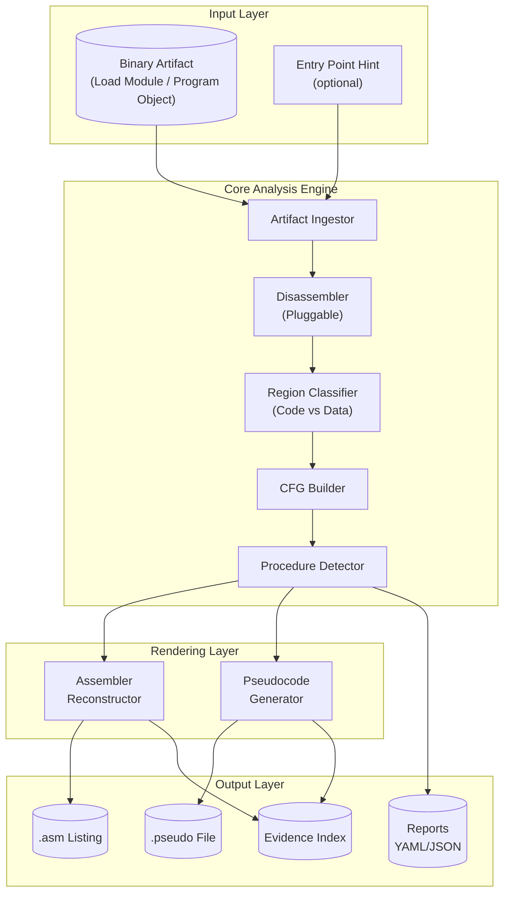

# Architecture Overview: z/OS Binary → Reconstructed Assembler + Pseudocode

**Document Version:** 1.0  
**Status:** Draft for Design Handoff  
**Audience:** Technical Design Agent, Developer Agent, Engineering Leadership

---

## 1. Executive Summary

This document defines the architecture overview for a **lean MVP tool** that reverse engineers z/OS load modules and program objects into:

1. **Reconstructed assembler-like code** (HLASM-style with synthetic symbols)
2. **Human-readable pseudocode**

**Core value proposition:**
- Automates understanding of z/OS binaries when source/listings are unavailable
- Provides strict **evidence traceability** (every output element links to address ranges and raw bytes)
- Foundation for future modernization pipelines (e.g., transformation to Java)

**Key constraints:**
- Input binaries are provided as files (extraction from mainframe is **out of scope**)
- Must support **offline operation** within client security boundaries
- Prioritizes **traceability + determinism + explainability** over completeness

---

## 2. Problem Statement and Business Drivers

### Problem
- Legacy z/OS applications often lack maintained assembler source or listings
- Understanding binary behavior requires manual reverse engineering—slow, error-prone, not scalable
- Modernization initiatives stall without accurate understanding of existing logic

### Business Drivers
- **Reduce analysis cost**: Automate what analysts currently do by hand
- **Enable modernization**: Provide foundation for code transformation pipelines
- **Audit and compliance**: Generate traceable artifacts for code review
- **Knowledge preservation**: Capture behavior before SME retirement

---

## 3. Goals

| ID | Goal | Success Criteria |
|----|------|------------------|
| G1 | Produce reconstructed assembler from z/OS binary | HLASM-like listing with synthetic labels for all identified code regions |
| G2 | Produce human-readable pseudocode | Structured pseudocode covering control flow constructs |
| G3 | Ensure evidence traceability | Every emitted line links to address range + hex bytes |
| G4 | Explicit confidence scoring | Inferred boundaries/structures tagged with confidence levels |
| G5 | Explicit unknowns | Unknown regions/instructions marked clearly, never silently invented |
| G6 | Deterministic output | Same input always produces identical output |
| G7 | Offline operation | No network dependency during analysis |

---

## 4. Non-Goals

| ID | Non-Goal | Rationale |
|----|----------|-----------|
| NG1 | Mainframe connectivity / extraction automation | MVP assumes files already exported |
| NG2 | Exact original source reconstruction | Labels, macros, comments are lost at compile time |
| NG3 | AI/ML-based analysis | Future integration option only |
| NG4 | Automated Java/COBOL transformation | Downstream of this tool |
| NG5 | Interactive debugger/emulator | Different tool category |
| NG6 | Support for non-z/Architecture binaries | Scope limited to z/OS artifacts |
| NG7 | IDE integration | CLI-first MVP |

---

## 5. Assumptions and Constraints

### Assumptions
- **A1**: Binary artifacts (load modules, program objects) are exported from LOADLIB/PDSE and provided as files
- **A2**: Input files contain valid z/Architecture machine code (not encrypted/obfuscated beyond standard packing)
- **A3**: Users have domain knowledge to interpret output (system programmers, modernization analysts)
- **A4**: Entry point(s) can be determined from artifact metadata or user hint

### Constraints
- **C1**: Must operate offline (no cloud calls during analysis)
- **C2**: Must run within client security boundary (on-prem VM, air-gapped acceptable)
- **C3**: No proprietary IBM tooling dependency in core pipeline
- **C4**: Output must be deterministic and reproducible
- **C5**: Must handle incomplete/partial analysis gracefully (mark unknowns, continue)

### What Improves Fidelity (but remains out of extraction scope)
- Binder metadata (IEWBLINK output) → better section boundaries
- CESD/ESD records → external symbol names
- IDR records → compilation timestamps, compiler identification
- Explicit entry point specification → accurate CFG root

---

## 6. Users and Key Use Cases

### Primary Users
- **Modernization Analysts**: Need to understand legacy logic for rewrite/refactor
- **System Programmers**: Debug or audit programs without source
- **Security Auditors**: Review binary behavior for compliance

### Key Use Cases

| UC | Actor | Description |
|----|-------|-------------|
| UC1 | Analyst | Analyze single load module, review pseudocode, trace specific routine |
| UC2 | Analyst | Batch-analyze portfolio of modules, generate index of procedures |
| UC3 | Auditor | Verify specific logic path with evidence back to bytes |
| UC4 | Developer | Feed reconstructed assembler into downstream transformation tool |
| UC5 | Operator | Re-run analysis for reproducibility verification |

---

## 7. Inputs and Outputs (Conceptual)

### Inputs

| Input | Format | Required | Notes |
|-------|--------|----------|-------|
| Binary artifact | File (load module / program object) | Yes | Exported from LOADLIB/PDSE |
| Entry point hint | Address or symbol | Optional | Improves CFG accuracy |
| Analysis config | YAML/CLI flags | Optional | Tune heuristics, output format |

### Outputs

| Output | Format | Contains |
|--------|--------|----------|
| Reconstructed Assembler | `.asm` text | HLASM-like listing with synthetic labels, address/hex annotations |
| Pseudocode | `.pseudo` text | Structured code with control flow, confidence markers |
| Analysis Report | YAML/JSON | CFG, call graph, procedure list, confidence scores |
| Evidence Index | YAML/JSON | Address→output line mapping for traceability |
| Portfolio Index | YAML (optional) | Summary across batch of modules |

### Evidence Traceability Format (Conceptual)

Every emitted element carries:
```
{
  "output_line": 42,
  "address_range": "0x000100-0x000104",
  "raw_bytes": "47F0C010",
  "confidence": "high",
  "inference_reason": "linear_decode"
}
```

---

## 8. System Architecture Overview



**Architecture Principles:**
- **Pipeline-based**: Each stage transforms and enriches an internal representation
- **Pluggable disassembler**: Core logic decoupled from instruction decode implementation
- **Evidence-first**: All transformations preserve address/byte linkage
- **Fail-safe**: Unknown regions marked, not skipped or invented

---

## 9. Major Components and Responsibilities

### 9.1 Artifact Ingestor
- **Input**: Binary file, optional hints
- **Output**: Normalized artifact model (sections, metadata, raw bytes)
- **Responsibilities**:
  - Detect artifact type (load module vs program object)
  - Parse header/control records (ESD, CESD, IDR if present)
  - Extract text sections and relocation data
  - Identify declared entry points

### 9.2 Disassembler (Pluggable Backend)
- **Input**: Raw bytes, address context
- **Output**: Stream of decoded instructions (IR)
- **Responsibilities**:
  - Decode z/Architecture instruction formats (2/4/6-byte)
  - Emit instruction IR with operand details
  - Flag decode failures as "unknown"
  - Pluggable: allow swap of decode engine without changing pipeline

### 9.3 Region Classifier
- **Input**: Decoded instruction stream, artifact metadata
- **Output**: Classified regions (code, data, unknown)
- **Responsibilities**:
  - Heuristic code vs data separation
  - Use constant pool patterns, alignment, branch targets
  - Mark low-confidence boundaries
  - Never silently discard—mark unknown

### 9.4 CFG Builder
- **Input**: Code regions, decoded instructions
- **Output**: Control flow graph (basic blocks, edges)
- **Responsibilities**:
  - Identify basic block boundaries (leaders)
  - Resolve branch targets (direct, conditional)
  - Handle indirect branches (mark as unresolved)
  - Build edge list with edge type annotations

### 9.5 Procedure Detector
- **Input**: CFG, call/return patterns
- **Output**: Procedure boundaries, call graph
- **Responsibilities**:
  - Detect standard linkage patterns (BALR, BASR, BR R14)
  - Identify LE-conformant prologues/epilogues
  - Group basic blocks into procedures
  - Build inter-procedure call graph
  - Assign confidence to inferred boundaries

### 9.6 Assembler Reconstructor
- **Input**: Procedures, instructions, evidence
- **Output**: HLASM-like text listing
- **Responsibilities**:
  - Generate synthetic labels (LOC_xxxx, PROC_xxxx)
  - Format instructions in assembler syntax
  - Annotate with address and hex bytes
  - Include confidence markers for inferred elements

### 9.7 Pseudocode Generator
- **Input**: CFG, procedures, instruction semantics
- **Output**: Structured pseudocode text
- **Responsibilities**:
  - Pattern-match control structures (if/else, loops, switch)
  - Emit readable variable names (R0-R15 → descriptive where inferable)
  - Preserve evidence links in comments/annotations
  - Mark uncertainty explicitly

### 9.8 Report Writer
- **Input**: All analysis artifacts
- **Output**: YAML/JSON reports, evidence index
- **Responsibilities**:
  - Serialize CFG, call graph, procedure list
  - Generate evidence index (address ↔ output line)
  - Produce summary statistics
  - Support batch portfolio indexing

---

## 10. Data Flow (Conceptual Pipeline)


**Pipeline Characteristics:**
- **Sequential stages**: Each builds on prior
- **Enrichment model**: IR grows richer through pipeline
- **Evidence preservation**: Address/byte links carried through all stages
- **Partial success**: Later stages work with whatever earlier stages produced

---

## 11. Integration Points (Current and Future)

### Current MVP Integration Points

| Point | Direction | Description |
|-------|-----------|-------------|
| File input | Inbound | Binary files dropped to input directory or passed via CLI |
| File output | Outbound | Analysis artifacts written to output directory |
| CLI interface | Inbound | Command-line invocation for scripting |

### Future Integration Options (Post-MVP)

| Point | Direction | Description |
|-------|-----------|-------------|
| REST API | Inbound | Enable service-based invocation |
| Message queue | Inbound | Batch processing via queue |
| Transformation pipeline | Outbound | Feed to Java/COBOL code generators |
| Knowledge base | Outbound | Export to documentation systems |
| AI enhancement | Bidirectional | LLM-assisted naming, pattern recognition |

---

## 12. Quality Attributes and How Architecture Addresses Them

| Attribute | Requirement | Architecture Approach |
|-----------|-------------|--------------|
| **Traceability** | Every output element traceable to source bytes | Evidence index, address annotations on all output |
| **Determinism** | Identical input → identical output | No randomness, no external state, ordered processing |
| **Explainability** | User can understand why tool made a decision | Confidence scores, inference reason tags |
| **Correctness** | Emitted instructions match actual bytes | Direct decode from binary, hex shown inline |
| **Completeness** | Handle all regions (even unknowns) | Unknown regions explicitly marked, not skipped |
| **Performance** | Reasonable time for typical module (<5MB) | Streaming pipeline, no full-graph-in-memory requirement |
| **Portability** | Run on multiple platforms | Pure software, no OS-specific dependencies in core |
| **Offline capability** | No network required | All analysis local, no cloud calls |

---

## 13. Security, Privacy, and Compliance Considerations

### Security
- **No outbound network calls**: Analysis runs fully offline
- **Input validation**: Reject malformed files gracefully, no buffer overflows
- **Output sanitization**: No executable code in output artifacts
- **Audit trail**: All runs can be logged with input hash, timestamp, version

### Privacy
- **Client data stays local**: No telemetry, no uploads
- **Output contains only derived data**: No injection of external content

### Compliance
- **Deterministic reproducibility**: Required for audit scenarios
- **Evidence chain**: Supports compliance verification workflows
- **Air-gap compatible**: Can deploy in restricted environments

---

## 14. Observability and Operability

### Logging
- **Structured logs**: JSON format, severity levels
- **Per-stage logging**: Entry/exit, item counts, warnings
- **Error context**: Include address, bytes, stage when failure occurs

### Metrics (Future Enhancement)
- Instructions decoded per second
- Procedures detected
- Confidence distribution
- Unknown region percentage

### Reproducibility
- **Version embedding**: Output includes tool version
- **Input hash**: Output includes SHA-256 of input
- **Configuration capture**: Analysis config stored with output

### Operability
- **Exit codes**: Distinct codes for success, partial success, failure
- **Progress indication**: For large files/batches
- **Resumability** (future): Checkpoint and resume for very large portfolios

---

## 15. Risks, Edge Cases, and Mitigations

### Risks

| Risk | Likelihood | Impact | Mitigation |
|------|------------|--------|------------|
| Misclassified data as code | Medium | Medium | Confidence scoring, user can override |
| Unresolved indirect branches | High | Medium | Mark as unresolved, don't guess targets |
| Overlapping code (self-modifying) | Low | High | Detect and flag, defer to user |
| Packed/encrypted sections | Low | High | Detect patterns, mark as opaque |
| Missing entry point info | Medium | Medium | Fall back to all-sections scan, lower confidence |
| Unusual linkage conventions | Medium | Medium | Pluggable heuristics, user hints |

### Edge Cases

| Case | Handling |
|------|----------|
| Zero-length module | Emit empty report with warning |
| All-data module (no code) | Report as "no code detected" |
| Very large module (>10MB) | Streaming processing, progress indication |
| Invalid instruction encoding | Mark as "invalid/unknown", continue |
| Mixed AMODE (24/31/64) | Detect and handle per-section |

---

## 16. Open Questions / Decisions Needed for Technical Design

| ID | Question | Options | Owner |
|----|----------|---------|-------|
| OQ1 | Disassembler implementation: build vs wrap existing? | (a) Custom decoder, (b) Wrap Capstone/Ghidra, (c) Pluggable interface with both | Technical Design |
| OQ2 | Internal IR format: structured objects vs flat records? | (a) Dataclass tree, (b) Flat list with refs, (c) SQLite-backed | Technical Design |
| OQ3 | Output file naming convention | (a) Hash-based, (b) Module-name-based, (c) Configurable | Technical Design |
| OQ4 | Confidence score granularity | (a) High/Medium/Low, (b) Numeric 0-100, (c) Both | Technical Design |
| OQ5 | Pseudocode style | (a) C-like, (b) Python-like, (c) Configurable | Technical Design |
| OQ6 | Batch parallelization approach | (a) Process-based, (b) Thread-based, (c) Async | Technical Design |
| OQ7 | Configuration file format | (a) YAML, (b) TOML, (c) JSON | Technical Design |
| OQ8 | How to handle LE runtime stub detection? | (a) Pattern library, (b) Signature DB, (c) User-defined | Technical Design |

---

## Appendix A: Example Output Mockups

### A.1 Reconstructed Assembler (Fragment)

```asm
*----------------------------------------------------------------------*
* PROC_00001000: Detected procedure at 0x001000                        *
* Confidence: HIGH | Entry: BALR pattern | Blocks: 3                   *
*----------------------------------------------------------------------*
         USING *,R12                   | Inferred base register
PROC_00001000 DS 0H
         STM   R14,R12,12(R13)         | 0x001000: 90ECD00C | Save regs
         LR    R12,R15                 | 0x001004: 18CF     | Establish base
         LA    R11,SAVEAREA            | 0x001006: 41B0C100 | -> 0x001100
         ST    R13,4(R11)              | 0x00100A: 5013B004 | Chain savearea
         LR    R13,R11                 | 0x00100E: 18DB     |
*
LOC_00001010 DS 0H
         L     R2,0(R1)                | 0x001010: 58201000 | Load parm
         LTR   R2,R2                   | 0x001014: 1222     | Test parm
         BZ    LOC_00001030            | 0x001016: 4780C030 | -> 0x001030
*
LOC_0000101A DS 0H
         ... (code continues)
*
LOC_00001030 DS 0H                     | Confidence: MEDIUM (single ref)
         L     R13,4(R13)              | 0x001030: 58D0D004 | Restore R13
         LM    R14,R12,12(R13)         | 0x001034: 98ECD00C | Restore regs
         BR    R14                     | 0x001038: 07FE     | Return
*----------------------------------------------------------------------*
```

### A.2 Pseudocode (Fragment)

```pseudo
// PROC_00001000 @ 0x001000-0x00103A
// Confidence: HIGH | Linkage: Standard LE
// Evidence: [0x001000-0x00103A] → see evidence_index.yaml

procedure PROC_00001000(R1: pointer):
    // Prologue - standard linkage
    save_registers(R14..R12)           // @0x001000
    base = R15                         // @0x001004
    
    // Parameter access
    parm = memory[R1 + 0]              // @0x001010
    
    if parm == 0:                      // @0x001014-0x001016
        goto epilogue                  // Branch to 0x001030
    
    // ... processing (confidence: MEDIUM)
    // [details omitted for brevity]
    
epilogue:                              // @0x001030
    restore_registers(R14..R12)        // @0x001034
    return                             // @0x001038
```

### A.3 Evidence Index (Fragment)

```yaml
evidence_index:
  - output_file: "PROC_00001000.asm"
    output_line: 7
    content: "STM   R14,R12,12(R13)"
    address_start: 0x001000
    address_end: 0x001003
    raw_bytes: "90ECD00C"
    confidence: high
    decode_method: linear
    
  - output_file: "PROC_00001000.pseudo"
    output_line: 12
    content: "if parm == 0:"
    address_start: 0x001014
    address_end: 0x001017
    raw_bytes: "12224780C030"
    confidence: high
    inference: "LTR+BZ pattern"
```

---

## Appendix B: Glossary

| Term | Definition |
|------|------------|
| **Load Module** | Executable program format in z/OS, stored in LOADLIB (PDS) |
| **Program Object** | Extended executable format in z/OS, stored in PDSE, supports >16MB |
| **LOADLIB** | Partitioned Data Set (PDS) containing load modules |
| **PDSE** | Partitioned Data Set Extended, supports program objects |
| **HLASM** | High Level Assembler, IBM's z/OS assembler |
| **z/Architecture** | IBM's 64-bit mainframe instruction set architecture |
| **ESD/CESD** | External Symbol Dictionary / Composite ESD - symbol table in load modules |
| **IDR** | Identification Record - compilation metadata in load module |
| **LE** | Language Environment - IBM's runtime for z/OS high-level languages |
| **AMODE** | Addressing Mode (24/31/64-bit) |
| **RMODE** | Residency Mode (below/above 16MB line, above 2GB bar) |
| **BALR/BASR** | Branch And Link Register - standard call instructions |
| **BR R14** | Branch Register 14 - standard return instruction |
| **CFG** | Control Flow Graph |
| **Basic Block** | Sequence of instructions with single entry and single exit |
| **Synthetic Label** | Generated label (e.g., LOC_xxxx) replacing unknown original |
| **IR** | Intermediate Representation |
| **Linkage Convention** | Standard register usage for calls/returns |
| **Constant Pool** | Data area (literals) embedded in code section |
| **Indirect Branch** | Branch whose target is computed at runtime |

---

*End of Architecture Overview Document*
